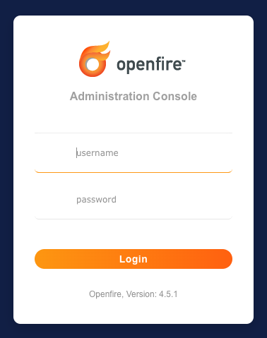
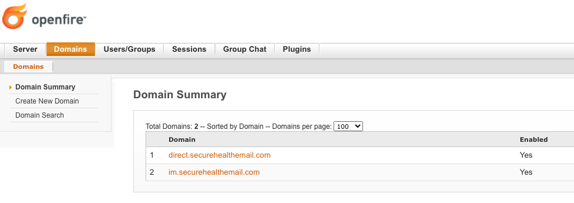
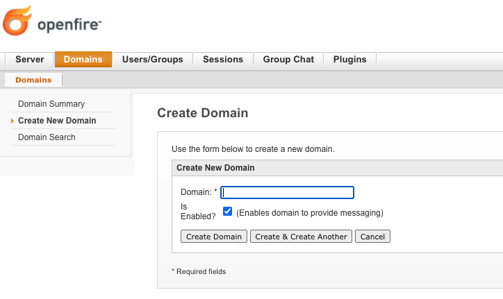
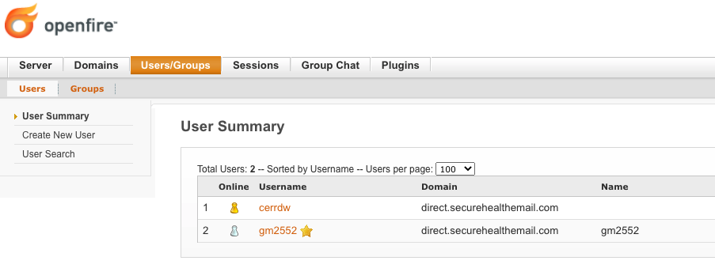
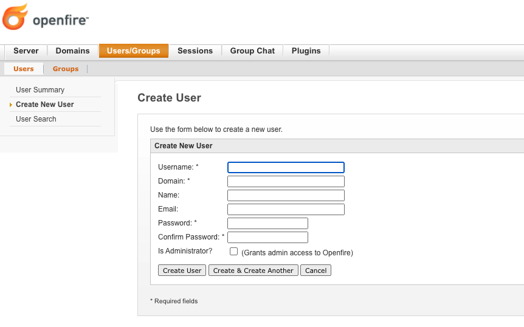

# Domain and User Creation

Domains and users are created using admin console web application.  By default the admin console is accessible at:

```
http://<server>:9090/
```



## Create Domain

After logging in using an admin username/password, click on the 'Domains' tab on the navigation bar across the top of the page.  You should see your default domain listed in the domains list.



To create a new domain, click the 'Create New Domain' link on the left side of page.  Type in your new domain name and decide if you would like it to be enabled or disabled (enabled by default).  Then click the 'Create Domain' button to add the domain to the system.



At this point, your new domain will be created along with two additional subdomains for group chat and file transfers.

## Create User

To access the user configuration page, click on the 'Users/Groups' tab navigation bar across the top of the page.  You should see your at least the admin user in the user list.



To create a new user, click the 'Create New User' link on the left side of page.  Type in your new username, domain to associate the user with, and a password.  You may optionally add the users real name and email address. Then click the 'Create User' button to add the user to the system.



At this point, the user should be able to login to the TIM+ server with a compliant TIM+ client.  **NOTE:**  Some XMPP server allow users to be created through XMPP client in-band registration as outline in [XEP-0077](https://xmpp.org/extensions/xep-0077.html).  The TIM+ reference implementation explicitly disables in-band registration and requires an administrator to create the user.

